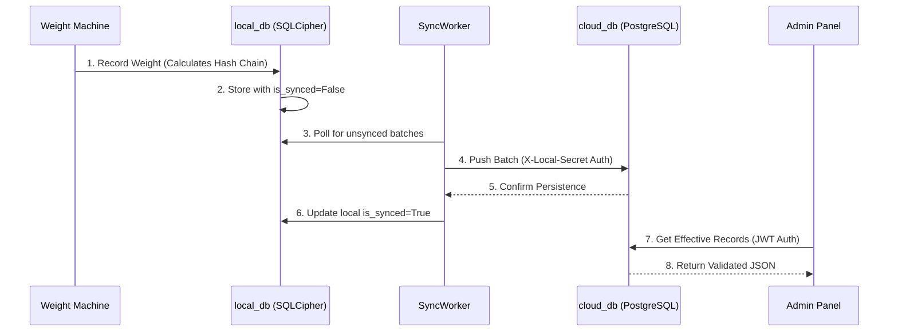

# Granular Technical Manual: Weighbridge System Architecture

This guide provides deep technical details for the frontend team to understand the internal mechanics of the Weighbridge backend, data integrity, and admin panel integration.

---

## 1. System Topology: Edge-to-Cloud
The system operates as a distributed network of **Edge Devices** (Local Backends) connected to a **Central Vault** (Cloud Backend).

### Local Backend (Edge)
- **Database**: Extended SQLite using **SQLCipher**.
- **Security**: Hardware-level key protection. 
- **Role**: High-availability weight recording with zero latency. It functions as a "Black Box" data logger.

### Cloud Backend (Vault)
- **Database**: PostgreSQL with JSONB indexing.
- **Role**: Centralized audit, machine management, and reporting dashboard.

---

## 2. Cryptographic Data Integrity (Deep Dive)
*Purpose: To ensure that no weight record can be modified or deleted without detection.*

### A. The Normalization Engine
Before hashing, data passes through `normalize_for_hash()`. 
- **Floats/Decimals**: Strictly formatted as strings with 3 decimal precision (`"1.200"`).
- **Strings**: Whitespace trimmed.
- **Keys**: Sorted alphabetically to ensure stable JSON object serialization.

### B. The Record Chain
Each record's `current_hash` is calculated as:
`SHA256(previous_hash || version || normalized_data_json)`
This creates a chronological dependency. If Record #50 is modified, the hash of Record #51 becomes invalid, breaking the entire downstream chain.

### C. Meta-Chained Checkpoints (Scalability)
To audits millions of records without scanning the whole DB every time, we use checkpoints.
- **The Meta-Chain**: Every 1,000 records, we store a `ChainCheckpoint`.
- **The Link**: Checkpoint N contains the hash of Checkpoint N-1 + the hash of the 1,000th record.
- **Verification**: The system only needs to verify the **Meta-Chain** (Checkpoints) to prove the integrity of historical blocks.

---

## 3. High-Integrity Correction Logic
Standard "Updates" and "Deletes" are forbidden by the database engine.

- **Logical Voiding**: When a user corrects a mistake, a *new* receipt is created.
- **`corrected_from_id`**: This field points to the original buggy record.
- **Query Resolution**: 
    - The backend uses a subquery to find records that have NEVER been referenced by a `corrected_from_id`.
    - These are the **Effective Records** shown in your standard tables.
    - Full history is preserved for auditors.

---

## 4. Admin Panel Architecture (Frontend)

### Stack & State
- **Framework**: React 18 + Vite.
- **Styling**: TailwindCSS with headless UI components.
- **State Management**: **Zustand** (`src/store/useStore.ts`) for global auth and toast states.
- **Service Layer**: Axios-based (`src/services/api.ts`) with interceptors.

### Authentication Flow
1. **Login**: Frontend sends credentials to `POST /admin/auth/login`.
2. **Persistence**: The returned JWT is stored in `localStorage`.
3. **Interception**: Every Axios request automatically attaches the `Authorization: Bearer <token>` header.
4. **Auto-Logout**: If the backend returns a `401 Unauthorized`, the interceptor clears local storage and redirects to `/login`.

---

## 5. Security Protocols

### Header-Based Protection
| Header | Usage | Purpose |
| :--- | :--- | :--- |
| `Authorization` | JWT Bearer | Authenticates individual Admin/User sessions. |
| `X-Local-Secret` | Machine UUID | Authenticates machine-to-machine sync requests. |
| `X-Request-ID` | Trace UUID | Tracks a request through logs for debugging. |

### Database Encryption (SQLCipher)
Local databases are encrypted using AES-256. The key is loaded via `app/security/key_loader.py` from the OS Keyring. This prevents "Database Harvesting" if the disk is cloned.

---

## 6. End-to-End Data Lifecycle (Visual)

---

## 7. Integration Checklist for Frontend Devs
- [ ] **Numeric Precision**: Ensure weight inputs/displays are fixed to 3 decimals.
- [ ] **Status Badges**: Use the `whatsapp_status` and `is_synced` fields to show real-time processing states.
- [ ] **Integrity Checks**: Implement a UI warning if `IntegrityService.verify_chain_integrity()` returns `is_valid: false`.
- [ ] **History Mode**: Use a toggle to switch between "Effective View" and "Audit History" via the `include_history` query param.
